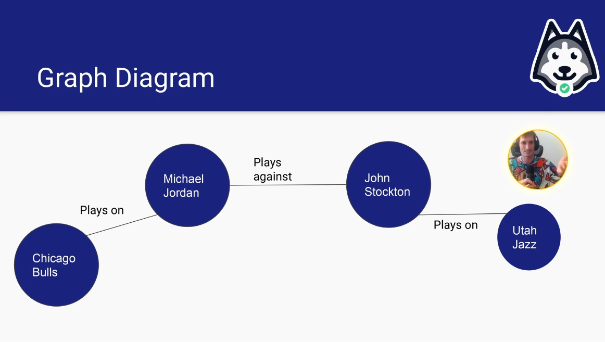

#  Dimensional Data Modeling

##  Graph Data Modeling Day 3 Lecture

| Concept                | Notes            |
|---------------------|------------------|
| **Graph Data Modeling**  | - More *relationship* focused and less entity focused    &emsp;• Looks at how things are connected    &emsp;• Flexible schema |
| **Flexible Data Types**  | - `MAP` is an example of a flexible data type    &emsp;• `STRUCT` is not flexible   &emsp;• `ARRAY` is semi-flexible |
| **Additive Dimensions**  | - Are not double-counted - If you take the subtotals of everything, and add them together to get a grand total   &emsp;• Example: Age is additive    &emsp;&emsp;• The population is equal to 20 year olds + 30 year olds + 40 year olds...   &emsp;• Application interface is NOT additive   &emsp;&emsp;• The number of active users!= # of users on web + # of users on Android +# of users on iphone   &emsp;• Counting drivers by cars is NOT additive   &emsp;&emsp;• The number of Honda drivers != # of Civic drivers + # of Corolla driver + # of accord drivers  - Can an entity have 2 dimensional values at the same time over some time frame? - **A dimension is additive over a specific window of time, if and only if, the grain of data over that window can only ever be one value at a time!**    Always think about how your dimensions interact with time!|
| **How Does Additivity Help?**  | - You don't need to use `COUNT(DISTINCT)` on preaggregated dimensions - Remember non-additive dimensions are usually only non-additive with respect to `COUNT` aggregagtions, but not `SUM` aggregations!    &emsp;• If the user can be 2 or more of these at the same time during any given day, then it's not additive |
| **Enums**  | - Are great for low-to-medium cardinality   &emsp;• But there is a limit! - Country is a great example of where Enums start to struggle  &emsp;• There's too many countries to limit them via an Enum  **Why should you use enums?**  &emsp;• Built in data quality  &emsp;&emsp;• If you get a value that doesn't fit in the enum, the pipeline fails because the value doesn't exist  &emsp;• Built in static fields  &emsp;• Built in documentation  - Should ideally be used for 50 or less possible values  - Enumerations make amazing subpartitions because   &emsp;• You have an exhaustive list  &emsp;• They chunk up the big data problem into managable pieces  - If you are looking at a bunch of data sets and wondering "wow, how do I manage this?", group those data sets into an enumerated group!|
| **How Do Enums Work?**  |  - N number of sources  - Enums get shared with the source functions   &emsp;• The source functions map the data to a shared schema via the Shared Logic ETL  &emsp;&emsp;• Shared Logic ETL calls the source function   &emsp;&emsp;• Shared Logic ETL maps it over into the shared schema  - The little book of Enums also has the data quality checks for that enumerated value  &emsp;• Even if you have a shared schema, you can have customized data quality checks on each partition depending on whatever is in the little book  - After the data quality checks pass, then you have the subpartitioned output  &emsp;• This subpartitioned output will have a date partition and a subpartition with the enumerated value
| **How the Little Book of Enums is Generated**  | - Usually an enumeration defined in Python or Scala   &emsp;• A job that turns the enumerated list into a tiny table enum values  &emsp;• This is how it can be shared between DQ checks and source functions  &emsp;• In the source functions, you pass it as Python  &emsp;• In the DQ Checks, you pass it as a table JOIN to get your thresholds for week over week, month over month, etc  - Check out the [Little Book of Pipelines](https://github.com/EcZachly/little-book-of-pipelines), an open-source GitHub resource for more|
| **When Is a Little Book of Enums Useful?**  | - Whenever you have tons of sources mapping to a shared schema   &emsp;• AirBnB   &emsp;&emsp;• Unit Econimics (fees, coupons, deposits, insurance, infrastructure cost, taxes, etc)  &emsp;• Netflix  &emsp;&emsp;• Infrastructure Graph (applications, databases, servers, code bases, CI/CD, jobs, etc)  &emsp;• Facebook  &emsp;&emsp;• Family of Apps (oculus, Instagram, Facebook, Messenger, WhatsApp, Threads, etc)|
| **Modeling Data From Disparate Sources Into Shared Schemas**  | - This can be done with a flexible schema   &emsp;• Don't bring in every column from every table   &emsp;• Leverages map data types   &emsp;• Overlaps with graph databases   &emsp;• If you need to add more things, put it in the map   &emsp;&emsp;• There is a limit, but it's high   &emsp;• ***Benefits***  &emsp;&emsp;• You don't have to run `ALTER TABLE` commands   &emsp;&emsp;• You can manage a lot more columns   &emsp;&emsp;• Your schemas don't have a ton of `NULL` columns  &emsp;&emsp;• `other_properties` column is pretty awesome for rarely-used-but-needed columns  &emsp;• ***Drawbacks***  &emsp;&emsp;• Compression is usually worse  &emsp;&emsp;&emsp;• Maps are pretty large and don't compress well  &emsp;&emsp;&emsp;• Especially if you use JSON  &emsp;&emsp;• Readability, queryability|
| **How Graph Data Modeling is Different**  | - Because graph modeling is *relationship* focused and *not entity focused*, you can do a very poor job at modeling the entries  &emsp;• ***Usually the model looks like:***   &emsp;&emsp;• Identifier: STRING   &emsp;&emsp;•Type: STRING  &emsp;&emsp;• Properties: MAP<STRING, STRING>  &emsp;•If you can remember this schema, your graph data modeling skills are mastered because they all have this flexible schema - We care about the **relationships**, not the entities themselves.  &emsp;• Less about how things *are* and more about *how they are connected*     - ***Relationships are modeled a bit more in depth:***  &emsp;• Usually the model looks like:  &emsp;&emsp;• subject_identifier STRING  &emsp;&emsp;• subject_type: VERTEX_TYPE  &emsp;&emsp;• object_identifier: STRING  &emsp;&emsp;• object_type: VERTEX_TYPE  &emsp;&emsp;• edge_type: EDGE_TYPE  &emsp;&emsp;• properties: MAP<STRING, STRING>   &emsp;• `EDGE TYPE` is almost always a verb (is, a, plays, with, has)  &emsp;&emsp;• A simple word that connects things |

##  Cues

- What is a primary focus of graph data modeling compared to dimensional or relational data modeling?
- How is schema flexibility in graph data modeling typically described?
- What is the challenge in non-additive dimensions when aggregating data?
- What is the challenge in non-additive dimensions when aggregating data?
- When should enums be used according to the lecture?
- What comprises the schema of an edge in a graph database?

---

##  Summary

Graph data modeling is an ideal way to understand how different entities are connected. This is because they are more relationship focused than entity focused. The schema is highly flexible, which allos properties to be easily added to vertices or edges without strict constraints.

With graph data modeling, it's important to think about how your dimensions interact with time. If you are able to add all the sub-totals of a dimension up, you are left with an additive dimension. If an entity can have two dimensional values at the same time over some time frame, this is a non-additive dimension. In non-additive dimensions, partial aggregations can lead to incorrect totals due to over-counting. Therefore, it's necessary to carefully handle distinct counts.

Enums are effective when there are fewer than 50 possible values, which allows built-in data quality and documentation benefits. Edges in a graph database have schema that includes subject and object identifiers and types, edge type, and properties. The focus of the edge's schema is to focus on relationships between notes. 