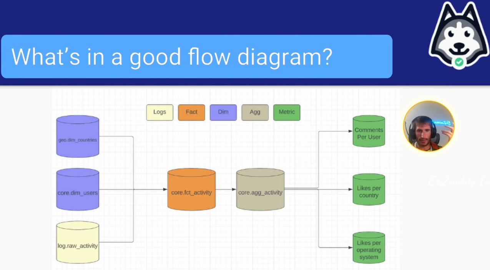

#  Data Quality Patterns

##  MIDAS Process from Airbnb Day 1 Lecture

| Concept                | Notes            |
|---------------------|------------------|
| **Rule of Thumb**  | - ***Good pipelines start with good documentation*** |
| **Working With Bad Data**  | - Symptoms include   &emsp;• Rage  &emsp;• Irritability  &emsp;• Insomnia |
| **Data Quality**  | - What is data quality?   &emsp;• DISCOVERABLE!   &emsp;&emsp;• If someone is trying to make a decision, and they are trying to make sure this data exists, it is easy to find it  &emsp;• Misunderstood/incomplete definitions of data quality  &emsp;&emsp;• Think about the gaps!  &emsp;&emsp;• Is there anything missing from the data set?  &emsp;&emsp;• **Black swan events** are difficult to predict for machine learning modules(i.e. the COVID-19 pandemic)  &emsp;• There aren't any `NULL`s or duplicates  &emsp;• There is business value being derived from the data  &emsp;&emsp;• Generally speaking, every single data pipeline you write is either going to generate or save money in some way  &emsp;• The data is easy to use  &emsp;&emsp;• The column names are obvious and make sense  &emsp;&emsp;• dim = dimension columns   &emsp;&emsp;• m = metric columns  &emsp;• The data arrives in a timely manner  &emsp;&emsp;• Come up with agreed upon arrival times and refresh rates to streamline the process - ***Data quality = data trust + data impact*** |
| **Building High Trust in the Data Sets You Build**  | - Before you start coding, *lean into empathy*!  &emsp;• Gather the stakeholders   &emsp;• "If cost and time was not a barrier, what data would you want?" &emsp;&emsp;• Gives you clarity on the problems they are trying to solve &emsp;&emsp;• Gives you ideas on what to do down the line  - A spec review of pipeline design  &emsp;• Every spec should be reviewed by another data engineer and a stakeholder  &emsp;&emsp;• Helps cover most of the requirements - Clarify the business impact *before* coding!  - Ask downstream stakeholders about all current and future needs &emsp;• Stakeholders will usually have a burning question they want answered ASAP  &emsp;&emsp;• What you build should help find them answers now and six months from now - Follow the AirBnB MIDAS process  &emsp;• Even one or two steps in the process can make a huge difference! |
| **AirBnB MIDAS Process**  | 1. Design Spec   &emsp;• "This is the pipeline we are going to build, and this is how we build it" 2. Spec Review   &emsp;• Technical and stakeholder  3. Build & Backfill Pipeline   &emsp;• Write the Spark/Airflow code   &emsp;• One month backfill first so your analysts do step 4 4. SQL Validation   &emsp;• Done by data analysts   &emsp;• Needs to happen by someone who isn't you to ensure bugs don't hide 5. Minerva Validation   &emsp;• Looking at the metrics via an open-source metric repository container 6. Data Review + Code Review  &emsp;• Make sure there aren't any modeling problems  &emsp;• Check for unit tests and integration tests 7. Minerva Migration 8. Minerva Review 9. Launch PSA  - **Why all this upfront work?** &emsp;• **Pre-build** stakeholder buy-in dramatically increases data trust!  &emsp;&emsp;• They give you their opinions &emsp;• They feel like they have skin in the game!  &emsp;&emsp;• They're a part of the process &emsp;• *This prevents painful backfills when you miss a requirement*  &emsp;&emsp;• Reduces the potential for miscommunications  - Stakeholder meetings are a unironically fun way to solve business problems together    **When should you do this heavy process?** &emsp;• Are important decisions being made on this data?  &emsp;&emsp;• If it's exploratory, it doesn't need all nine steps &emsp;• Is this data not going to change much over the next year? &emsp;&emsp;• If the data is going to change a lot, then it may not be worth it to do all the steps until the next change &emsp;• The nine step process is for multi-year master data that won't be subjected to very disruptive change &emsp;&emsp;• Or if it is subjected to disruptive change, it happens on a couple-year basis  &emsp;• Remember, sometimes **not** doing the heavy process provides more value |
| **Building Good Data Documentation**  | - People can learn about what you are creating faster |
| **Data Quality Checks**  | - How are they different between facts and dimensions?   - **Basic checks**    &emsp;• Not `NULL`, is there data, no duplicates, make sure enum values are all valid (data lake)  &emsp;• Every pipeline should have these basic checks all the time - **Intermediate checks**   &emsp;• Row count looks good, week-over-week row count cut by dimensions looks good   &emsp;• Week-over-week gives you a better trend idea   &emsp;• Intermediate checks usually fail on Christmas because of seasonality  &emsp;• Are business rules enforced?  - **Advanced checks**   &emsp;• Seasonality adjusted row counts looks good   &emsp;• Can be expensive to bring in  &emsp;&emsp;• As your data infrastructure improves, generally speaking advanced checks become easier to add|
| **Good Design Spec Ingredients**  | - Description   &emsp;• Why are you building this?  - Flow Diagrams  &emsp;• How things position   &emsp;• How data goes from raw data to fact/dimension data and metrics - Schemas  &emsp;• DDL statements   &emsp;• `CREATE TABLE` statements   &emsp;• Column comments to discuss oddities - Quality checks - Metric Definitions  &emsp;• What are you trying to measure?  - Example Queries  &emsp;• Helpful if you have `STRUCT`s and `ARRAY`s |
| **Good Flow Diagram Example**  |   - fct_activity is master data &emsp;• Most people will be querying this  - agg_activity  &emsp;• Aggregate this to get granulated metrics  - Lucid Chart is a way you can make these   &emsp;• Google Drawing is another way|
| **What Does a Good Schema Look Like?**  | - Good names   &emsp;• Probably fct, dim, scd, or agg in the name to demonstrate the type of table it is! - Column comments on every column - Follow the naming conventions your company chooses! - If they don't have naming conventions, there's a spot for huge impact!  &emsp;• Figure out if there is a reason |
| **Dimensioal Quality Checks**  | - Dimensional tables usually:   &emsp;• Grow or are flat day-over-day   &emsp;&emsp;• Table is growing check is very common (i.e. are there more rows today than there were yesterday?)  &emsp;• Don't grow sharply  &emsp;&emsp;• Percent difference from last week should be small  &emsp;• Have complex relationships that should be checked   &emsp;&emsp;• Think foreign keys in a relational world   &emsp;&emsp;• Sometimes connections have to exist, and if they do, they should be checked|
| **Fact Quality Checks**  | - Have seasonality to them   &emsp;• Week-over-week is much better than day-over-day - Affected by holidays  &emsp;• Christmas and New Years false positive a lot - Can grow and shrink  &emsp;• Table is Growing is not a good check here  - More prone to duplicates   &emsp;• Deduplicate check is a must  &emsp;&emsp;• If you're using Presto, use `APPROX_COUNT_DISTINCT` instead of `COUNT(DISTINCT)` for deduped checks   &emsp;&emsp;&emsp;• It's 99.9% the same, but dramatically more efficient - More prone to `NULL`s and other row-level quality issues - Have references to entities that should exist  &emsp;• Similar to FK checks in relational |

##  Cues

- What is the primary goal of the MIDAS process at Airbnb?
- What is emphasized as critical in building trust in data sets?
- Why should quality checks avoid using 'count distinct' in Presto?
- When is it appropriate to skip the full MIDAS process?
- Which step is emphasized before creating a data pipeline in MIDAS?

---

##  Summary

Before creating a pipeline, you should obtain stakeholder input and clarify the spec. This helps ensure the pipeline will meet all user requirements and have a higher likelyhood of success. The MIDAS process is designed to ensure data pipelines are durable, understandable, and improve over time, maximizing their long-term value. Implementing a full quality process may not be beneficial for data that frequently changes. It's better to wait until the changes stabalize.

Proper documentation essential for others to understand, debug, and improve data pipelines. This, in turn, helps build trust in your data sets. If you are using Presto, `COUNT(DISTINCT)` can cause performance issues. `APPROX_COUNT_DISTINCT` is more efficient and provides similar accuracy.
