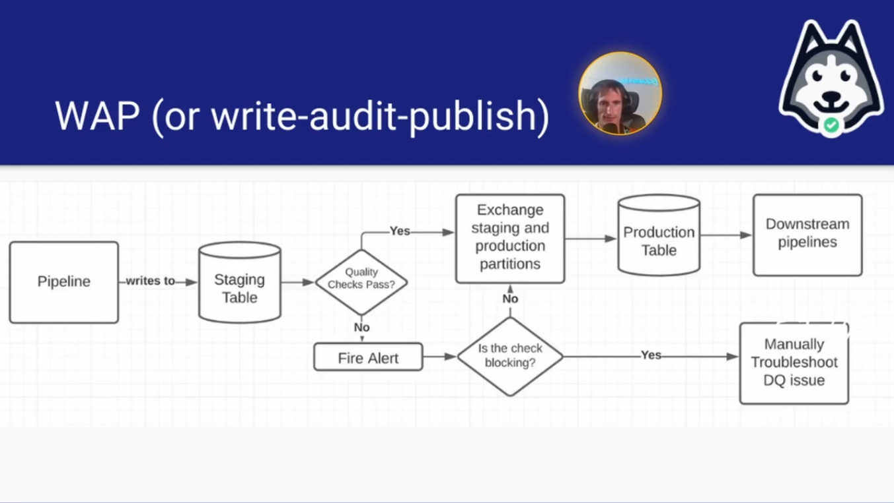
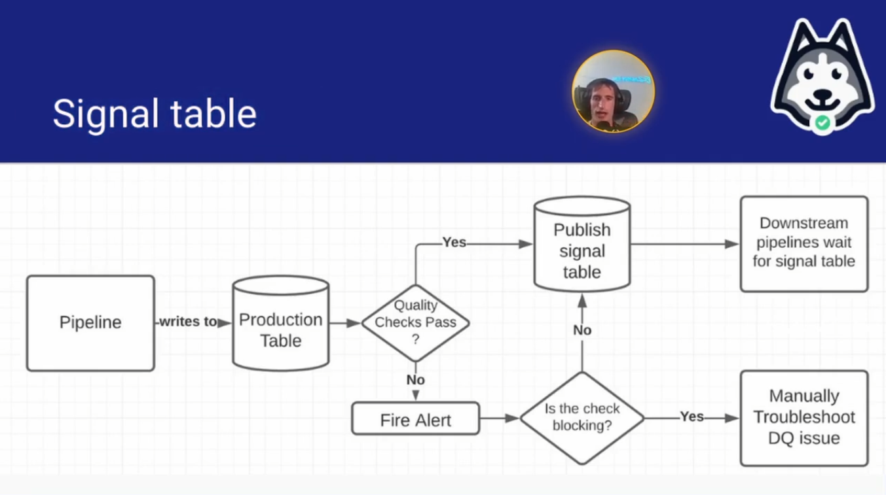

#  Data Quality Patterns

##  WAP Patterns Day 2 Lecture

| Concept                | Notes            |
|---------------------|------------------|
| **WAP Pattern**  | - Write, Audit, Publish   &emsp;• How you ensure good quality data gets pushed to production - How it works   &emsp;• Write data to a staging table that has the same schema as prodution   &emsp;• Run your quality checks/audits   &emsp;• If the checks pass, publish staging to production  - Implementing this pattern can help prevent 80-90% of data quality issues |
| **Causes of Bad Data (not all comprehensive)**  | - Logging errors   &emsp;• More for fact data  &emsp;• i.e. a software engineer changes the schema of the logs and the table schema no longer matches   &emsp;• Other logging bugs - Snapshotting errors  &emsp;• More for dimensional data  &emsp;• A bit rare  &emsp;• You are missing dimensions or users due to production data quality issues - Production data quality issues   &emsp;• Bad data exists in production - Schema evolution issues  &emsp;• Can happen with snapshotting and logging errors - Pipeline mistakes making it into production - Non-idempotent pipelines and backfill errors - Not thorough enough validation |
| **Validation Best Preactices**  | - Backfill a small amount of data (~1 month) - Have someone else check all your assumptions - Produce a validation report   &emsp;• Duplicates   &emsp;• Nulls   &emsp;• Violations of business rules   &emsp;• Time series/volume  |
| **Writing to Production is a *Contract***  | - It means you checked the data the best you could! - The components of the contract:   &emsp;• Schema  &emsp;• Quality checks  &emsp;• How data shows up in production |
| **Two Contract Flavors**  |  1. Write, Audit, Publish (WAP)   &emsp;• Blocking quality checks require troubleshooting  &emsp;• Non-blocking quality checks don't block the data, but there's something strange with the data   - **Pros**   &emsp;• Downstream pipelines can intuitively depend on the production table directly  &emsp;• No chance of production data getting written without passing the audits  - **Cons**   &emsp;• Partition exchange can be something that delays the pipeline by several minues.   &emsp;• More likely to miss SLA   2. Signal table   &emsp;• The signal table tells the downstream pipeline that the data is ready to go   &emsp;• The downstream needs to wait for the signal table, *not* on the production table   &emsp;• Does not cater to ad hoc queries very well   - **Pros**   &emsp;• Data lands in just one spot and never has to be moved  &emsp;• More likely to hit SLA   &emsp;• Data lands sooner - **Cons**   &emsp;• Non-intuitive for your downstream users   &emsp;&emsp;• What if they forget you have a signal table?   &emsp;• Higher likelihood of propagating DQ errors because of this non-intuitive design  &emsp;• Adhoc queries may return results from data that has failed audits|
| **When These Contracts Are Violated**  | - ***PROPAGATES BAD DATA***  - If you have no downstream dependencies, it's not a big issue  &emsp;• If you have a lot, it's a *big* issue |
| **Bad Metric Definitions**  | - Bad metric definitions can cause bad data, too.  - The more different data points and dimensions your metric depends on, the more prone it is to error   &emsp;• i.e. knowing the engagement per qualified minute of Ethiopean children who use 7 year old iPhone devices on Christmas days is going to be a "noisy" metric   &emsp;• Can't do data quality checks on metrics that are too narrow because you get to a point where normalities don't exist anymore|

##  Cues

- What does WAP stand for in the context of data quality patterns?
- What issues can be caused by a logging error in data processing?
- What is a major disadvantage of using the Signal Table pattern over the WAP pattern?
- What is an effective way to prevent bad data propagation in heavily used data pipelines?
- Why is having another person validate a data pipeline important?

---

##  Summary

In the context of data quality patterns, WAP stands for write, audit, and publish. Logging errors can lead to incorrect row counts, schema mismatches, and issues such as double form submissions when buttons are not properly disabled.

Signal table patterns can lead to data quality issues being overlooked in ad hoc queries since data is written directly to production, whereas WAP ensures quality checks before publishing. Thorough data validation and quality checks ensure that only high-quality data is propagated, especially in pipelines with many downstream dependencies.

Having someone else validate the pipeline allows for a fresh perspective and can help identify mistakes that the original creator may have overlooked.
