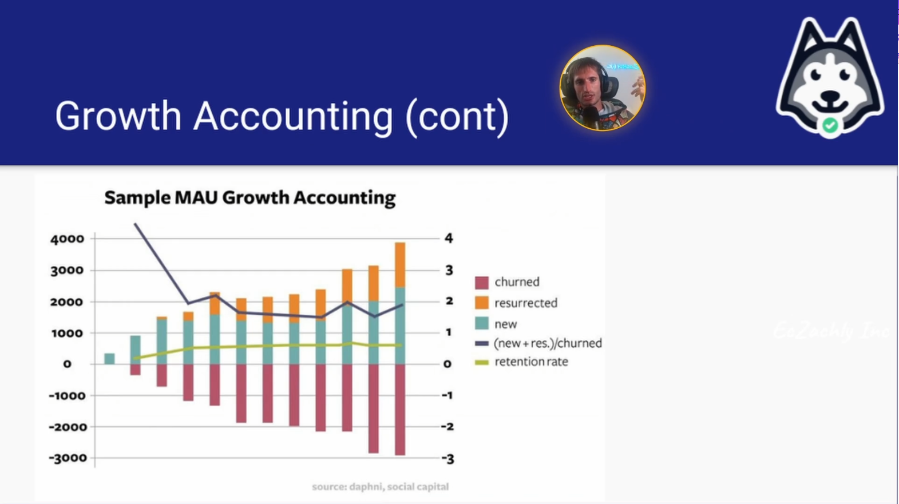

#  Applying Analytical Patterns

##  Exploring SQL, Scaling Projects and Aggregation Analysis Day 1 Lecture

| Concept                | Notes            |
|---------------------|------------------|
| **A Note To Start**  | - Not all pipelines are built differently   &emsp;• If you can identify higher-level patterns, you can figure out the best types of pipelines to implement  - ***Repeatable analyses are your best friend because they allow you to think at a higher level***  &emsp;• Instead of thinking about `GROUP BY` and `SELECT`, you can think a layer above this   &emsp;• Think of this as an "extension" of SQL |
| **Analytical Patterns**  | - Growth Accounting   &emsp;• i.e. how Facebook tracks inflows and outflows of active and inactive users  &emsp;• Or any other state change tracking   &emsp;• Closely related to cumulative table design concepts  - Survival Analysis Pattern   &emsp;• i.e. of all the users who are active today, how many are still around?  - State change tracking   &emsp;• Closely connected with SCDs   &emsp;• SCDs have records for every different value of a dimension   &emsp;• Instead of keeping all of the *values* of a dimension, state change logs every time the values *changed* |
| **Common Pattterns to Learn**  | - Aggregation-based patterns - Cumulation-based patterns  - Window-based patterns  - Enrichment patterns do not take place in this realm because we already have all the columns we need |
| **Repeatable Analyses**  | - Reduce cognitive load of thinking about the SQL   &emsp;• Think bigger picture!   &emsp;• How can you apply higher-level patterns? - Streamline your impact   &emsp;• xxx |
| **Aggregation-Based Patterns**  | - Most common patterns   &emsp;• `GROUP BY` used often  &emsp;• Counting things  &emsp;• Trend analysis   &emsp;• Root cause analysis  &emsp;&emsp;• Explaining the movement of metrics  &emsp;&emsp;• If you start seeing a shift in a metric, you can bring in other metrics to investigate  &emsp;• Percentile   &emsp;• Composition   &emsp;• Add charts showing the composition of something    &emsp;• **Gotchas**  &emsp;&emsp;• Think about the combinations that matter the most   &emsp;&emsp;• Be careful looking at many-combination, long-time fram analyses (> 90 days)  &emsp;&emsp;&emsp;• You don't want too many cuts in your data when you have a long timeframe because time is a dimension with high cardinality |
| **Cumulation-Based Patterns**  | Time is significantly different dimensions vs other ones  - `FULL OUTER JOIN` is your friend   &emsp;• You need to keep track of when there *isn't* data (no data IS data in cumulation-based patterns!)   &emsp;• Built on top of cumulative tables - Common for the following patterns:    &emsp;•  State transition tracking  &emsp;&emsp;• Shows the shift of state between yesterday and today   &emsp;• Retention (AKA J curves or survivor analysis)  |
| **Growth Accounting**  | - Special version of state transition tracking   &emsp;• New   &emsp;&emsp;• Didn't exist yesterday, active today  &emsp;• Retained   &emsp;&emsp;• Active yesterday, active today  &emsp;• Churned  &emsp;&emsp;• Active yesterday, inactive today   &emsp;• Resurrected   &emsp;&emsp;• Inactive yesterday, active today   &emsp;• Stale  &emsp;&emsp;• Inactive yesterday, inactive today  &emsp;• Deactivated also exists   &emsp;&emsp;• Inactive yesterday, deleted today   &emsp;&emsp;• Only sometimes there      - Think of growth rate as new + resurrected minus churn - Great for monitoring and machine learning models |
| **Survivor Analysis**  | - J-curves have 3 points  &emsp;• The curve   &emsp;&emsp;• Examples: Users who stay active, boot camp attendees who keep attending all the sessions, smokers who remain smoke-free after quitting   &emsp;• The state check   &emsp;&emsp;• Activity on the app, activity on Zoom, not smoking  &emsp;• The reference date   &emsp;&emsp;• Examples: sign up date, enrollment date, quit date |
| **Window-based Analyses**  | - Day over day / week over week / month over month / year over year   &emsp;• Examining the rate of change over a range of time  - Rolling sum/average   &emsp;• Decreases the volatility - Rank   &emsp;• For more complex ranks  - Example of a window function  &emsp;• `FUNCTION() OVER (PARTITION BY keys ORDER BY sort ROWS BETWEEN n PRECEDING AND CURRENT ROW)`  &emsp;&emsp;• Usually sorted by date  &emsp;&emsp;• Partition by the dimensional cut is   &emsp;&emsp;• n = number of rolling days   **Gotchas** - Be sure to use `PARTITION BY` or else it will cause OOM when the data is too large |

##  Cues

- What is the purpose of using analytical patterns in data engineering?
- In the context of SQL and data analytics, what does aggregation-based analysis primarily utilize?
- How does cumulation-based analysis differ from aggregation-based analysis in terms of data handling?
- What is survivorship bias as explained in the lecture?
- What is an example of a common window-based analysis mentioned in the lecture?

---

##  Summary

The lecture emphasizes that recognizing higher-level analytical patterns allows data engineers to implement effective pipelines quickly. This streamlines the analysis process and reduces cognitive load.

Aggregation-based analysis relies on `GROUP BY` to organize data into subgroups and uses functions like `SUM`, `COUNT`, and `AVERAGE` to perform calculations on these groups. Cumulation-based patterns are concerned with the transitions between states over time. They handle missing data as meaning ful information, unlike traditional aggregation patterns that may disregard missing data.

Survivorship bias occurs when only the successful outcomes or entities that survived a process are considered, potentially leading to incorrect conclusions by ignoring those that did not survive. The lecture covers window-based analysis as involving operations like day-over-day or month-over-month analyses utilizing window functions to calculate derivatives or rolling averages.
