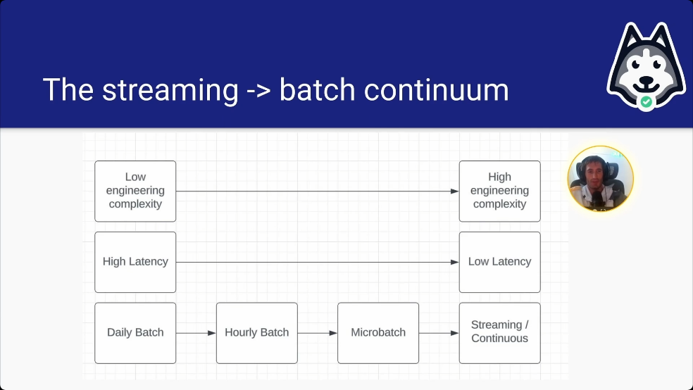

#  Streaming Pipelines

##  Mastering Streaming and Real-time Pipelines Day 1 Lecture

| Concept                | Notes            |
|---------------------|------------------|
| **Streaming Pipelines**  | - Streaming pipelines process data in a low-latency way  - **Streaming vs near real time vs real time**   &emsp;• Streaming (or continuous)  &emsp;&emsp;• Data is processed as it is generated  &emsp;&emsp;• Example: Flink   &emsp;• Near real-time  &emsp;&emsp;• Data is processed in small batches every few minutes  &emsp;&emsp;• Example: Spark Structured Streaming  &emsp;• Real-time and streaming are often synonymous, but not always!  &emsp;• Less technical people may think real-time and batch are synonymous   &emsp;• **Microbatching** is synonymous with near real-time. Data is processed in small batches |
| **Real-time From Stakeholder POV**  | - Rarely means streaming  - Usually means low-latency or predictable refresh rate |
| **When Streaming Should Be Used**  | - Considerations   &emsp;• Skills on the team  &emsp;• What is the incremental benefit?  &emsp;• Homogeneity of your pipelines  &emsp;• The tradeoff between daily batch, hourly batch, microbatch, and streaming  &emsp;• How should data quality be inserted  &emsp;&emsp;• Batch pipelines have easier DQ paths |
| **Streaming-only Use Cases**  | - **Key: *Low latency makes or breaks the use case***  - Examples:   &emsp;• Detecting fraud, preventing bad behavior   &emsp;• High-frequency trading   &emsp;• Live event processing |
| **Gray-area Use Cases**  | - Data that is served to customers - Reducing the latency of upstream master data   &emsp;• Notifications dataset had a 9 hour after midnight latency  &emsp;• Micro batch cut to 1 hour |
| **No-go Streaming Use Cases**  | - Batch should be used instead  - Ask the question   &emsp;• What is the incremental benefit of reduced latency?  - Analyst complain that the data isn't up-to-date   &emsp;• Yesterday's data by 9am is good enough for *most* analytical use cases|
| **How Streaming Pipelines Are Different From Batch Pipelines**  | - *Streaming pipelines run 24/7*! Batch pipelines run for a small percentage of the day  - Streaming pipelines are much more software engineering oriented   &emsp;• They act more like servers than DAGs - Streaming pipelines need to be treated as such and have more unit test and integration test coverage like servers! |
| **The Streaming->Batch Continuum**  |  - The lower the latency, the higher the engineering complexity  - Real time is a myth!  &emsp;• You'll have seconds of latency just for the event generation -> Kafka -> Flink -> sink  - Pipelines can be broken into 4 categories   &emsp;• Daily batch  &emsp;• Hourly batch (sometimes called near real-time)  &emsp;• Microbatch (sometimes called near real-time)  &emsp;• Continuous processing (usually called real-time) |
| **Structure of a Streaming Pipeline**  | - **The source**   &emsp;• Examples: Kafka, RAbbitMQ  &emsp;&emsp;• Enriched dimensional sources (i.e. side inputs)  &emsp;&emsp;• Denormalization of fact data or bringinging in other SCDs  &emsp;&emsp;• Data can refresh on a cadence to get the right data for each events - **The compute engine**   &emsp;• Examples  &emsp;&emsp;• Flink   &emsp;&emsp;• Spark structured streaming  &emsp;• These engines make sense of the incoming streams of data  - **The destination, AKA "the sink"**  &emsp;• Common sinks  &emsp;&emsp;• Another Kafka topic  &emsp;&emsp;• Iceberg  &emsp;&emsp;• Postgres|
| **Streaming Challenges**  | - ***Out of order events***   - ***Late arriving data*** - ***Recovering from failures*** |
| **Out of order events**  | - How does Flink deal with out-of-order events?  &emsp;• **WATERMARKING** ensures there are no events newer than the watermark  &emsp;&emsp;• Give yourself a window for each event where over the next N seconds, it's considered OK there's a possiblility of out of order events, and Flink will fix it for you |
| **Late-Arriving Data**  | - How late is too late?   - Batch handles this mostly by waiting, although batch has issues around midnight UTC, too! - Watermarking and late-arriging data are similar concepts  &emsp;• Watermarking is more for the 99% of data that arrives out of order in the window   &emsp;• Late-arriving data is more for the long tail of the small amount of data that comes in exceptionally late |
| **Recovering from failures**  | - When streaming pipelines fail, the longer it stays down, the more and more it gets backed up   - Flink manages this in a few ways:  &emsp;• Offsets  &emsp;&emsp;• When Flink starts up, you have to specify earliest offset, latest offset, or a specific moment in time   &emsp;&emsp;• Earliest offset  &emsp;&emsp;&emsp;• Means read everything in Kafka as far back as we can go  &emsp;&emsp;• Latest offset  &emsp;&emsp;&emsp;• Only read in new data after the job starts  &emsp;&emsp;• Specific timestamp (i.e. when it failed)  &emsp;&emsp;&emsp;• Only read results that match this timestamp or are newer   &emsp;• Checkpoints  &emsp;&emsp;• Internal to Flink, used for Flink itself  &emsp;&emsp;• You can tell Flink to checkpoint every N number of seconds and it saves the state of the job from that point in time &emsp;&emsp;• Then Flink knows where to read from and where to write things to if things fail so when you start it up again, it doesn't re-read everything   &emsp;• Savepoints   &emsp;&emsp;• More like a CSV file used for systems other than Flink |

##  Cues

- Which technology is primarily used for a continuous processing engine in streaming pipelines?
- What is a key characteristic of a streaming pipeline?
- How does Apache Flink handle out of order events?
- What is a benefit of batch processing over streaming processing in terms of data quality?
- When is streaming processing essential over other methods?

---

##  Summary

Apache Flink is the best example of a streaming continuous processing engine, which processes data events immediately as they are generated. Streaming pipelines process data in a low-latency manner, meaning data is processed shortly after generation. This distinguishes them from traditional batch processing.

Apache Flink uses watermarks to define windows of time during which out of order events can be corrected, ensuring the accurate ordering of data. Batch processing has clear steps where data quality checks can easily be inserted, unlike streaming, which is continuous without distinct steps. Streaming processing is crucial for situations like fraud detection where immediate data processing is necessary to prevent or mitigate issues quickly.
