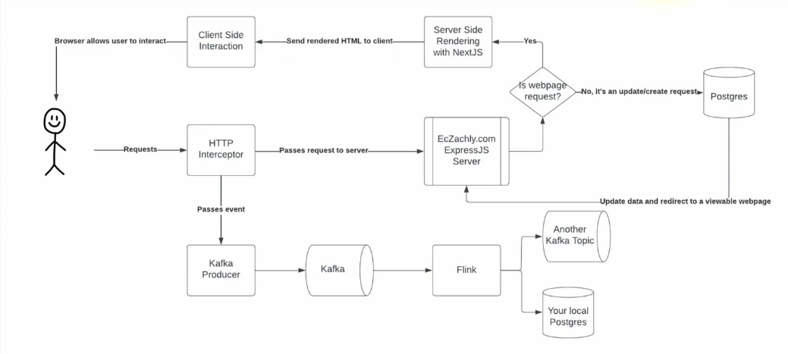

#  Streaming Pipelines

##  Exploring Data Collection and Processing Day 2 Lecture

| Concept                | Notes            |
|---------------------|------------------|
| **Anatomy of Streaming**  |  <br><br>- Client side interaction <br> &emsp;• Allows the user to interact with the website <br>- [HTTP Interceptor](#http-interceptor)<br> &emsp;• Receives requests from the user <br> &emsp;• Logs it to Kafka <br> &emsp;&emsp;• Passes the event to the [Kafka producer](#kafka-producer) <br> &emsp;&emsp;• Read Kafka from Flink<br> &emsp;&emsp;&emsp;• Bumb it to the Kafka job and the local Postgres server<br> &emsp;• Also passes the request to the server so the website can decide how to handle it <br> &emsp;&emsp;• If the request is a webpage request, complete server side rendering with NextJS<br> &emsp;&emsp;• If the request is an update/create request, pass it to Postgres <br> &emsp;&emsp;&emsp;• Update the data and reflect to a viewable webpage <br>- ***Streaming needs to have a way to intercept real-time events***<br>- Kafka Consumers <br> &emsp;• Publishes real time events and passes relevent events to cleints<br> &emsp;• Low latency (i.e. seconds)|
| **WebSockets**  | - The client asks the server for more data <br> &emsp;• If you want the server to send stuff to the client as well, you have to create a websocket |
| **The Competing Architectures**  | - Lambda architecture<br> &emsp;• Optimizes for latency and correctness<br> &emsp;• Eats a bit of pain in complexity<br> &emsp;• Double the code base<br> &emsp;&emsp;• You have a batch pipeline and a streaming pipeline that both write the same data <br> &emsp;&emsp;• The batch pipeline is there if the streaming one fails<br> &emsp;• Easier to insert the data quality checks on the batch side<br>- Kappa architecture <br> &emsp;• Pros: <br> &emsp;&emsp;• Least complex <br> &emsp;&emsp;• Great latency wins<br> &emsp;• Can be painful when you need to read a lot of history <br> &emsp;&emsp;• You need to read things sequentially <br> &emsp;• Delta Lake, Iceberg, and Hudi are making this architecture much more viable<br> &emsp;&emsp;• Iceberg has an append function that allows the batch world and the streaming world to be mostly married  |
| **Flink UDFs**  | - UDFs, generally speakaing, won't perform as well as built-in functions <br> &emsp;• Use UDFs for custom transformations, integrations, etc<br> &emsp;• Python UDFs are going to be even less performant since Flink isn't native Python |
| **Flink Windows**  | - Data-driven windows <br> &emsp;• Count<br>- Time-driven windows<br> &emsp;• Tumbling<br> &emsp;• Sliding<br> &emsp;• Session |
| **Flink Windows (Count)**  | - Window stays open until N number of events occur <br> &emsp;• You can give it a key (such as per user so there is a window per user)<br>- Useful for funnels that have a predictable number of events <br>- Can specify a timeout since not everybody will finish the funnel<br>- Very powerful for funnel analytics because they often times have a fixed number of events|
| **Flink Windows (Tumbling)**  | - Fixed size <br>- No overlap<br> - Similar to hourly data<br> - Great for chunking data|
| **Flink Windows (Sliding)**  | - Fixed width, but has overlap<br> - Captures more windows<br> - Good for finding "peak-use"/"peak-time" windows<br> - Good at handling "across midnight" exceptions in batch <br>- Used less commonly than tumbling|
| **Flink Windows (Sessions)**  | <br>- User-specific <br> &emsp;• Window lasts until there's a big enough gap  in between activity <br> &emsp;• You define this gap<br> &emsp;• Helps analyze user activity<br>- Variable length <br>- Based on activity<br>- Used to determine "normal" activity |
| **Allowed Lateness vs Watermarking**  | - **Watermarks** <br> &emsp;• Defines when the computational window will execute<br> &emsp;• Helps define ordering of events that arrive out-of-order <br> &emsp;• Handles idleness, too <br>- **Allowed lateness**<br> &emsp;• Usually set to 0 <br> &emsp;• Allows for reprocessing of events that fall within the late window<br> &emsp;• ***Caution: Will generate/merge with other records!**|

### HTTP Interceptor

```JavaScript
// Req = request, res = response
// next is called when the request is passed to the server
export default function createAPIEventMiddleware(req, res, next) {
    const shouldBeLogged = 
        // Ensures events that happen while in development mode 
        // aren't logged to Kafka
        req.url && !req.hostname.includes('localhost') && !isFileRequest(req);
    const event = {
        url: req.url,
        referrer: req.headers.referer,
        user_agent: JSON.stringify(useragent.parse(req.headers['user-agent'])),
        headers: JSON.stringify(req.headers),
        host: req.headers.host,
        ip: req.connection.remoteAddress,
        event_time: new Date(),
    };

    if (shouldBeLogged) {
        Promise.all(values:[
            sendMessageToKofka({...event}),
        ]).then(() => {
            next();
        });
    } else {
        next();
    };
}
```

### Kafka Producer

```JavaScript
export default function sendMessageToKafka(message: object) {
    const producer = new Kafka.Producer(options: {
        connectionString: process.env.KAFKA_URL,
        ssl: {cert: process.env.KAFKA_CLIENT_CERT...},
    });

    const messageObject = {
        topic: 'porcupine-78436.bootcamp-events',
        message: {...},
    } as Message;

    producer
        .init() Promise<Client>
        .then(() => {
            return producer.send(data: [messageObject]);
        }) Promise<Result[]>
        .then((result:Result[]) => {
            console.log('Message sent successfully', result);
            return producer.end();
        }) Promise<void>
        .catch((err) => {
            console.err('Error sending message', err);
            return producer.end();
        });
}
```

##  Cues

- What is the primary role of the HTTP interceptor in the described architecture?
- Which technology is used to handle real-time event data in the described architecture?
- In the context of the lecture, what describes the relationship between React and the server?
- What is a key difference between Lambda and Kappa architectures mentioned?
- How do WebSockets differ from typical HTTP requests in the context of real-time updates?


---

##  Summary

The HTTP interceptor's primary role is to intercept incoming requests, log them to Kafka, and then let them pass through to be handled further. Kafka is the tool used here to handle real-time event streams by queuing the data which can later be consumed by stream processing frameworks like Flink. The architecture described employs React for server-side rendering, generating HTML before the data is sent to the client.

Lambda architecture involves maintaining both a batch and a streaming pipeline to handle potential problems in real-time data accuracy. WebSockets allow bi-directional communication between the client and the server, enabling real-time updates by allowing the server to send data without a client request
