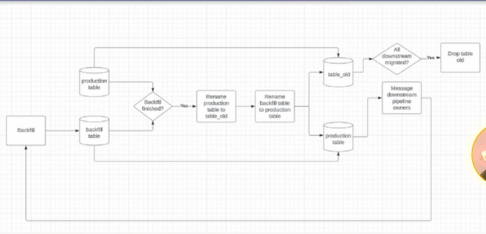

#  Data Pipeline Maintenance

##  Navigating the Complexities of Data Engineering Day 1 Lecture

| Concept                | Notes            |
|---------------------|------------------|
| **Difficult Parts of Data Engineering**  |  - Data engineering isn't just writing SQL and sipping martinis on a beach!   &emsp;•  High expectations  &emsp;&emsp;• Building pipelines is a **marathon**  &emsp;&emsp;• Analytics is a **sprint**  &emsp;&emsp;• ***Say no to sprinting the marathon***  &emsp;&emsp;&emsp;• Every time you cut corners, you will pay for it later  &emsp;• 90%+ of data engineers are experiencing burnout right now  &emsp;• Protect your peace, and you will last longer - Data quality issues - Every time you build a pipeline, you have to maintain it   &emsp;• There is a continual cost that adds up over time  - Unclear priorities/ ad hoc requests|
| **Ad Hoc Requests**  | - Analytics need to solve an **URGENT** problem   &emsp;• If everything is urgent, nothing is - Allocate ~5-10% per quarter to ad hoc requests  &emsp;• Half a day a week   &emsp;• If the request is ad hoc and complex, you shouldn't drop what you are doing   &emsp;• Low hanging fruit can be prioritized, though!  &emsp;• Consider ROI- if they are asking for a project, put it on the road map - Get analytics partners input for quarterly planning so ad hoc requests become scalable models  &emsp;• Plan stuff out! It helps! :) |
| **Ownership Models**  | - Who owns what?   &emsp;• Data sets  &emsp;• Data pipeline   &emsp;• Data documentation   &emsp;• Metrics   &emsp;• Experiments   - ***The most common ownership model:***   &emsp;• **Primary software engineer ownership**   &emsp;&emsp;• Logging/exports  &emsp;• **Primary data engineer ownership**   &emsp;&emsp;• Pipeline   &emsp;&emsp;• Master data  &emsp;• **Primary data analyst/scientist ownership**   &emsp;&emsp;• Metrics or Aggregate Master Data  &emsp;&emsp;• Dashboards/Experiments  &emsp;• Overlap in ownership exists as well when needed   &emsp;• Business questions are related to metrics usually   - ***Another common ownership model:***   &emsp;• **Primary software engineer ownership**   &emsp;&emsp;• Logging/exports  &emsp;• **Primary analytics engineer ownership**   &emsp;&emsp;• Pipeline   &emsp;&emsp;• Master data  &emsp;&emsp;• Metrics or Aggregate Master Data  &emsp;• **Primary data analyst/scientist ownership**   &emsp;&emsp;• Dashboards/Experiments  &emsp;• Overlap in ownership exists as well when needed   &emsp;• Business questions are related to metrics usually |
| **Common Ownership Problems**  | - Arise at the boundaries   &emsp;• Data engineers owning logging or metrics   &emsp;• Data scientists writing pipelines  - Going too deep into someone else's box can burn you out faster   &emsp;• Work *together*   &emsp;• There should be a secondary person in case someone takes time off |
| **Centralized vs Embedded Teams**  | - ***Centralized***   &emsp;• Many data engineers in one team  &emsp;• On call is easier   &emsp;&emsp;• Regarding on call, it is good to discuss the potential consequences of not being able to address outages at odd hours  &emsp;• Knowledge sharing, data engineers supporting data engineers  &emsp;• Expensive!  &emsp;• Prioritization can get complex   - ***Embedded***  &emsp;• Data engineers in other engineering teams   &emsp;• Dedicated DE support  &emsp;• Data engineer gains deep domain knowledge  &emsp;• Islands of responsibility   &emsp;• Data engineers can feel isolated|
| **Common Pipeline Issues**  | - Skewed pipelines with Out of Memory exceptions - Missing data/schema change of upstream data - Backfill needs to trigger downstream data sets  -Business questionsabout where and how to use data |
| **How to Fix Skew**  | - Best option   &emsp;• **Upgrade to Spark 3**  and enable adaptive execution! - Second best option   &emsp;• Bump up the executor memory and hope it's not more skewed later - Third best option   &emsp;• Update the job to include a skew join salt |
| **Fixing Missing Data / Schema Change**  | - Pre-check your upstream data!   &emsp;• This will prevent your pipeline from running if it's missing data! - Track down the upstream owner   &emsp;• Fill out a task/ticket/etc to have them fix the issue  &emsp;&emsp;• Both unblock and long-term fix |
| **Good Data Migrations**  | - How backfills work   &emsp;• **For small migrations**   &emsp;&emsp;• Do a parallel backfill into `table_backfill`  &emsp;&emsp;• If everything looks good, do the "shell game"  &emsp;&emsp;&emsp;• Rename `production` to `production_old`  &emsp;&emsp;&emsp;• Rename `table_backfill` to `production`  &emsp;• **If people need a lot more time migrate (a lot more painful)**  &emsp;&emsp;• Build a paralell pipeline that populates `table_v2` while `production` gets migrated  &emsp;&emsp;• After all references to `production` have been updated, drop production and rename table_v2 (and all its references) to `production`  - Let downstream engineers know when you rename columns in case they are working with them|
| **Business Questions**  | - Set expectations on when you'll get back to people. Maybe it's 2 hours, maybe it's a day?   - Consolidate common questions into a document so you don't have to keep answering the same questions over and over again  - Is this the same or differnt oncall from the pipeline oncall? - Make sure your analytics partners are looped in, here! |

##  Cues

- What is a common consequence of having too many data pipelines as a data engineer?
- Why is data engineering often considered to have high expectations leading to burnout?
- What is typically the most important part of properly handling ad hoc requests in data engineering?
- In what way is building data pipelines compared to historical infrastructure projects?
- How can data engineers reduce potential burnout caused by on-call duties?

---

##  Summary

As more pipelines are created, the likelihood of failure increases. This requires more on-call responses, increasing maintenance costs and leading to potential burnout. High expectations stem from dealing with unclear priorities and persistent data quality issues, which contribute to stress and burnout. It's important to prioritize requests based on their return on investiment. This ensures complex requests are strategically placed into the roadmap rather than rushed.

Understanding the exact impact helps prioritize and manage tasks better, which reduces unnecessary stress and burnout. Just as sustainable infrastructure supports long-term use, data pipelines should be carefully constructed to ensure quality and maintainability over time.
