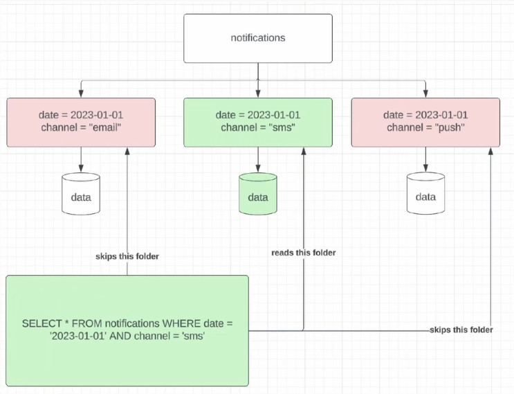
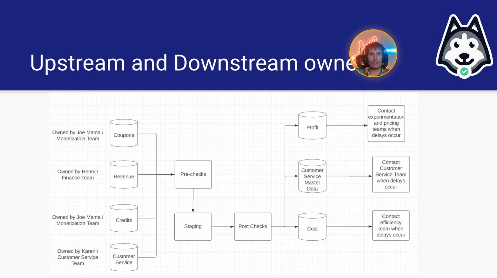

#  Data Pipeline Maintenance

##  Strategies for Maintenance and Dock Building Day 2 Lecture

| Concept                | Notes            |
|---------------------|------------------|
| **Signals of Tech Debt in Data Engineering**  | - Painful pipelines that break or are delayed - Large cloud bills  - Multiple sources of truth - Unclear data sets that aren't documented|
| **Path Forward for Painful Pipelines**  | - The only thing better than optimized is deprecated! - Is there anything that can be done?   &emsp;• Migrate to new technology  &emsp;&emsp;• Hive to Spark migration?   &emsp;&emsp;&emsp;• Often sees an order of magnitude and increase in efficiency. Especially for pipelines that use high-cardinality `GROUP BY` and/or `JOIN`  &emsp;• Implement better data modeling  &emsp;• Bucketing?  &emsp;• Sampling? - Deprecating without a replacement can be a hard sell!  |
| **Sampling**  | - When should you sample?   &emsp;• If directionality is what you care about, sampling is good  &emsp;• Make sure to consult a data scientist on this to guarantee you get the best sample of the data set  &emsp;• You want a random sample  - When should you not sample?  &emsp;• If you need the entire data set for auditing, sampling won't work! |
| **Bucketing**  | - You should consider bucketing when   &emsp;• You have an expensive high-cardinality `JOIN` or `GROUP BY`  - ***Shuffle:*** When you `JOIN` two data sets, the `JOIN` key gets hashed as a number and gets %'d out. The remainder is the partition the row is assigned to.  &emsp;• The default modulo in Spark is 200  - You can write the left and right data sets to their own partitions - An important optimization techniques for the highest volumes of data &emsp;• Writing the left and right side to bucketed tables allow you to `JOIN` without shuffle |
| **Large Cloud Bills**  | - IO (Input/Output) is usually the number one cloud cost!   &emsp;• Signal tables can help here   &emsp;• WAP does a partition exchange, so every time you write a table, you pay your IO costs twice  - Followed by compute   &emsp;• Fixed cost - Then storage   &emsp;• Cheap in comparison to IO and Compute  - If your pipeline is producing data that will be visualized in a dashboard and it is a final aggregate layer, your biggest cost will probably be in **compute** and then storage   - Too much IO can happen because   &emsp;• Duplicative data models    &emsp;• Inefficient pipelines  &emsp;&emsp;• Use cumulative design when possible   &emsp;• Excessive backfills   &emsp;• Not sampling    &emsp;• Not subpartitioning your data correctly  &emsp;&emsp;• Predicate pushdown is your friend  &emsp;&emsp;• Subpartitions allow you to avoid reading in a big chunk of data you don't nee to read in  - **Large IO and compute costs** are correlated by:  &emsp;• Scanning too much data (use cumulative tables)  &emsp;• O(n^2) algorithms applied in UDFs (nested loops are usually bad) - **Large IO and storage costs** are correlatd by:   &emsp;• Not leveraging Parquet file format effectively   &emsp;• Duplicative data models|
| **Why Subpartitions Minimize IO**  |  - Subpartition on `date` and `channel`  &emsp;• When this query runs in Spark, it will skip all folders except for the ones highlighted in green.   &emsp;• This helps reduce IO costs  - Subpartitions should have 30 or less values |
| **Multiple Sources of Truth**  | - Some of the hardest but most impactful work for data engineers - **Steps**   &emsp;• Document all sources and the discrepancies   &emsp;&emsp;• Talk with all relevent stakeholders!  &emsp;&emsp;• If you can code search for similar names, that works great  &emsp;&emsp;• Lineage of the shared data is a good place to start, too   &emsp;• Understand from stakeholders why they needed something different   &emsp;&emsp;• There's usually a reason why there's multiple data sets   &emsp;&emsp;• Could be organizational, ownership, technical, skills, etc   &emsp;&emsp;• Work with stakeholders to find an ownership model that works  &emsp;• Build a spec that outlines a new path forward that can be agreed upon   &emsp;&emsp;• Capture all the needs from the stakeholders   &emsp;&emsp;• Get all the multiple sources of truth owners to sign off  &emsp;&emsp;&emsp;• Helps with migration later|
| **Models For Getting Ahead of Tech Debt**  | 1. Fix "as you go"  &emsp;• Fix the tech debt as you implement new features   &emsp;• *Pros*   &emsp;&emsp;• There isn't much incremental burden  &emsp;• *Cons*  &emsp;&emsp;• Tech debt rarely actually gets tackled because it's the last priority  2.  Allocate a portion of time each quarter  &emsp;• *Pros*   &emsp;&emsp;• You fix things in big bursts   &emsp;&emsp;• You actually fix a lot of problems   &emsp;• *Cons*  &emsp;&emsp;• You tie up the team for a week   &emsp;&emsp;• Tech debt builds up throughout the quarter   3. Have the on-call person focus on tech debt during their shift    &emsp;• *Pros*   &emsp;&emsp;• They fix bugs as they arise  &emsp;• *Cons*  &emsp;&emsp;• On-call person does nothing else that week |
| **Data Migration Models**  | - The extremely cautious approach   &emsp;• Be careful not to break anything   &emsp;• Parallel pipelines for months - The bull in a china shop approach  &emsp;• Efficiency wins, minimize risk by migrating high-impact pipelines first   &emsp;• Kill the legacy pipeline as soon as you can |
| **Proper On-call Responsibilities**  | - Set proper expectations with your stakeholders! - ***Document every failure and bug***   &emsp;• You will thank yourself later!  - On-call handoff   &emsp;• Should be a 20-30 min sync to pass context from one on-call to the next |
| **Runbooks**  | - Complex pipelines need runbooks  &emsp;• Pipelines with many inputs, outputs used by a lot of teams, complex logic, a lot of data quality checks, etc   &emsp;• Runbooks should be linked in the spec - ***Most important pieces***  &emsp;• Primary and secondary owners   &emsp;&emsp;• **Primary owner** owns the pipeline and should be contacted to help troubleshoot if you need help when on call   &emsp;&emsp;• If the primary owner is on vacation, tap the **secondary owner**   &emsp;• Upstream owners   &emsp;&emsp;• Helpful to provide information in the event the upstream data fails   &emsp;&emsp;• *Team ownership changes less than individuals*   &emsp;&emsp;• **Teams, not individuals**   &emsp;• Common issues (if applicable)  &emsp;• Critical downstream owners   &emsp;&emsp;• **Teams, not individuals**  &emsp;• SLAs and agreements  - ***Runbooks vs Specs***   &emsp;• Can sometimes be referred to interchangably|
| **Example Flow**  |   - You should have regularly occurring meetings with people on both sides of the stream!  &emsp;• Monthly or quarterly one-on-ones with owners and groups |
| **Example Runbook**  | - On-call runbook for EcZachly Inc Growth Pipeline   &emsp;• **Primary owner:** Zach   &emsp;• **Secondary owner:** Lulu    **Common Issues**  &emsp;• Upstream datasets   &emsp;&emsp;• Web site events   &emsp;&emsp;&emsp;• Common anomalies   &emsp;&emsp;&emsp;&emsp;• Sometimes referrer is `NULL` too much, this is fixed downstream but we are alerted about it because it messes with the analytics  &emsp;&emsp;• User database exports   &emsp;&emsp;&emsp;• Export might fail to be extracted on a given day, when this happens, use yesterday's export for today   &emsp;&emsp;&emsp;&emsp;• *Remember, this is not idempotent*   &emsp;• Downstream consumers   &emsp;&emsp;• Experimentation platform   &emsp;&emsp;• Dashboards   **SLAs** The data should land 4 hours after UTC midnight|

##  Cues

- What is a primary reason for deprecating a data pipeline according to the lecture?
- Why might a company choose to use aggressive data migration over cautious migration?
- What is a potential benefit of using sampling in data pipelines?
- When is it not advisable to use sampling as a strategy in pipeline maintenance?
- Which is a common indicator of tech debt in data engineering mentioned in the lecture?
- What should you consider when deciding whether to deprecate a data pipeline?
- What is a major advantage of migrating from Hive to Spark for certain types of data pipelines?
- Why is sampling considered as a strategy to improve pipeline performance?
- What is the primary downside of the 'dedicated time' approach in managing tech debt?
- What should be documented in a data pipeline's runbook?

---

##  Summary

Having multiple sources of data with conflicting definitions creates alignment issues, representing a significant form of tech debt. There are several ways to manage tech debt, which each have pros and cons.

Deprecating unnecessary pipelines reduces operational and maintenance costs, especially saving on cloud expenses. A company may choose to use aggressive data migration over cautious migration because the aggressive migration strategy forces stakeholders to adopt new pipelines quickly. This reduces costs and the duration of maintaining parallel systems. A pipeline that frequently breaks, fails, or has a high maintenance cost is a candidate for deprecation.

Sampling reduces the amount of data processed, which minimizes computational demand without significantly affecting overall data insights. Sampling can be suitable for certain analytical tasks. However, it's not advisable to use sampling as a strategy in pipeline maintenance when the entire dataset is necessary for auditing purposes because it omits certain data points.

Spark can provide major efficiency gains due to its RAM usage, especially for pipelines using high cardinalty GROUP BY or JOIN operations, making it much faster compared to disk-based processing in Hive. Runbooks and specs are a good way to maintain pipelines. A runbook documents common pipeline issues, SLAs, and primary and secondary owners. The goal is to facilitate troubleshooting, establish expectations, and identify the right contact persons during failures.
